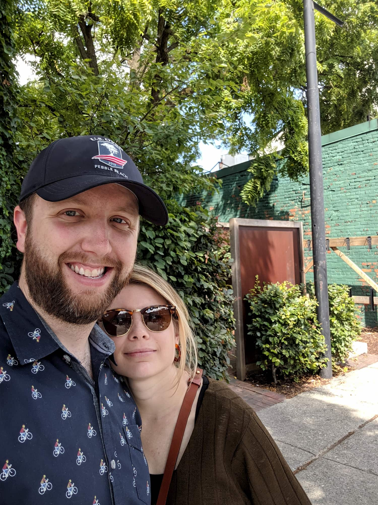
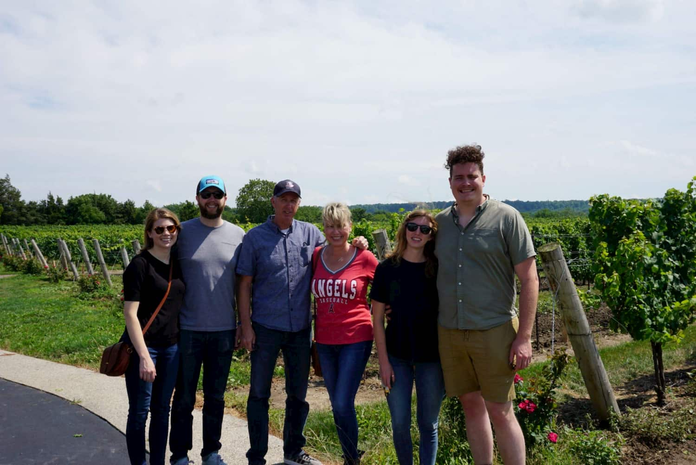

First trip to Toronto!

<!-- end -->

## Toronto

We finally made our way up to Toronto to visit my sister and brother-in-law,
who have been living out there for a couple of years now while my he works on
his advanced degree.

Niagara falls was a ton of fun, the views were great although it was incredibly crowded for what felt like the off-season for us.

Toronto was a very interesting city with a lot of great stuff to do, but I felt like we weren't in the city long enough to develop an idea of the vibe or how to best approach it. We had a great lunch at Momofuku Noodle bar, and then walked around various parts of downtown.

One of the bigger highlights was CN Tower, definitely splurge and go all the way to the tippity top.

Cactus Festival in sisters small town south of Toronto

The Jenkins Family together
